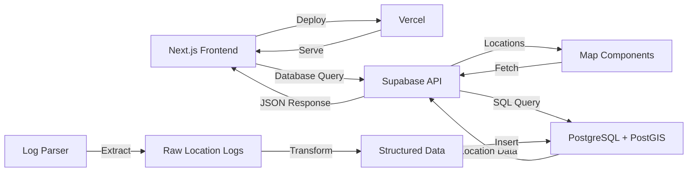

# Log2Map

> Try it now: [log2map](https://log2map.vercel.app)

A full-stack application that parses location logs and visualizes them on interactive maps, built with Next.js 13+ and Supabase.

## Features

### Core Functionality
- **Log Processing**
  - Parse raw location logs with timestamps and coordinates
  - Batch processing support
  - Automatic timestamp and coordinate extraction
  - Data validation and error handling

- **Map Visualization**
  - Interactive 2D maps with Leaflet
  - 3D terrain visualization with Google Maps
  - Clustered markers for large datasets
  - Real-time location updates

- **Data Analysis**
  - Location accuracy tracking
  - Distance calculations
  - Temporal analysis
  - Spatial querying

### Technical Features
- **Modern Stack**
  - Next.js 20+ App Router
  - Server & Client Components
  - TypeScript for type safety
  - Middleware for request handling

- **Database & Storage**
  - PostgreSQL with PostGIS extension
  - Spatial indexing for efficient queries
  - Real-time data synchronization via Supabase
  - Secure data access control

- **UI/UX**
  - Responsive design with Tailwind CSS
  - shadcn/ui component library
  - Dark/light mode support
  - Mobile-friendly interface

## Architecture

### Technology Stack
- Frontend: Next.js 20+ (App Router)
- Deployment: Vercel
- Database: Supabase (PostgreSQL + PostGIS)
- Maps: Leaflet (2D) & Google Maps (3D)
- Styling: Tailwind CSS & shadcn/ui

### System Architecture



## Getting Started

### Prerequisites
1. Supabase Project
2. Node.js 20+ installed
3. Google Maps API Key (for 3D visualization)

### Database Setup
Execute the following SQL in your Supabase SQL Editor:

```sql
-- Create location logs table with PostGIS support
create table public.parsed_logs (
    id bigint generated by default as identity not null,
    timestamp_ms bigint not null,
    location geography not null,
    accuracy double precision null,
    raw_message text null,
    created_at timestamp with time zone null default current_timestamp,
    constraint parsed_logs_pkey primary key (id)
);

-- Create spatial index
create index parsed_logs_geo_index on public.parsed_logs using gist (location);
```

### Deployment
1. Configure environment variables:
```bash
# Rename .env.example to .env.local and update:
NEXT_PUBLIC_SUPABASE_URL=[INSERT SUPABASE PROJECT URL]
NEXT_PUBLIC_SUPABASE_ANON_KEY=[INSERT SUPABASE PROJECT API ANON KEY]
GOOGLE_MAPS_API_KEY=[INSERT GOOGLE MAPS API KEY]
```

2. Install dependencies and start the development server:
```bash
npm install
npm run dev
```

The application will be available at [localhost:3000](http://localhost:3000)

3. Commit & Push
4. Vercel will detect the change and deploys automatically 


## More Examples
- [Next.js Subscription Payments Starter](https://github.com/vercel/nextjs-subscription-payments)
- [Cookie-based Auth and the Next.js 13 App Router (free course)](https://youtube.com/playlist?list=PL5S4mPUpp4OtMhpnp93EFSo42iQ40XjbF)
- [Supabase Auth and the Next.js App Router](https://github.com/supabase/supabase/tree/master/examples/auth/nextjs)
